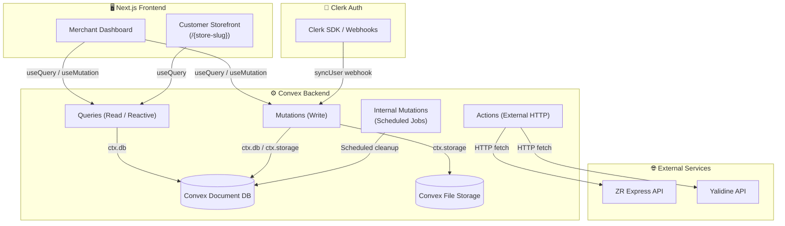
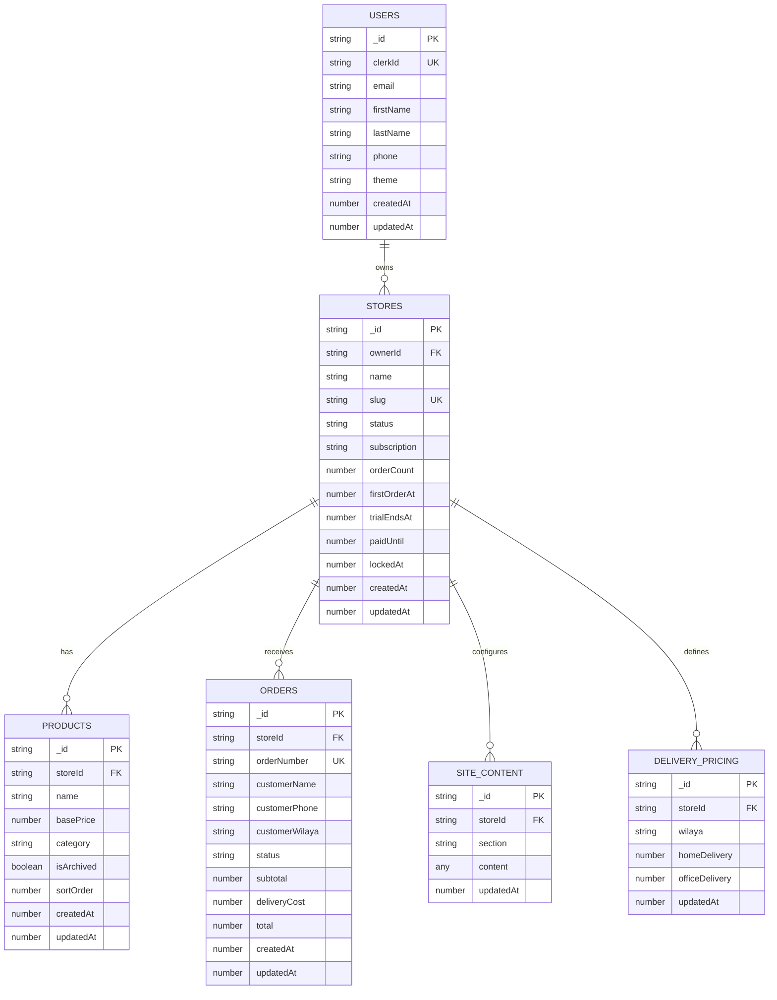
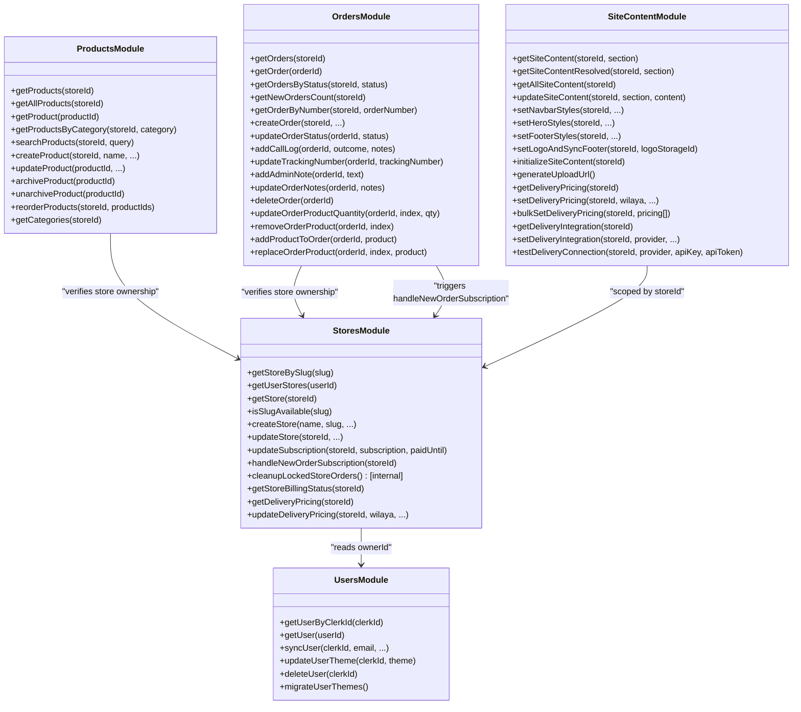
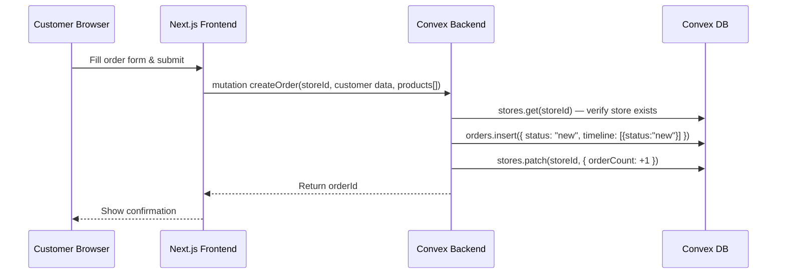
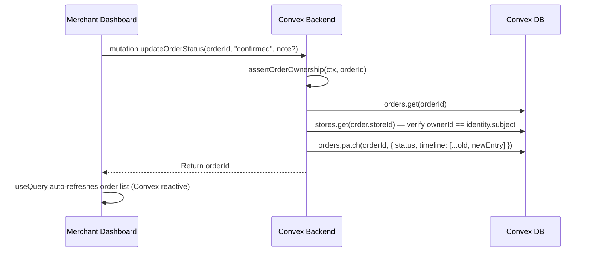
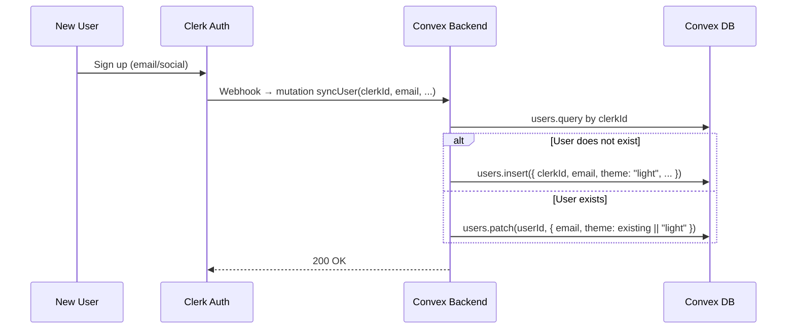
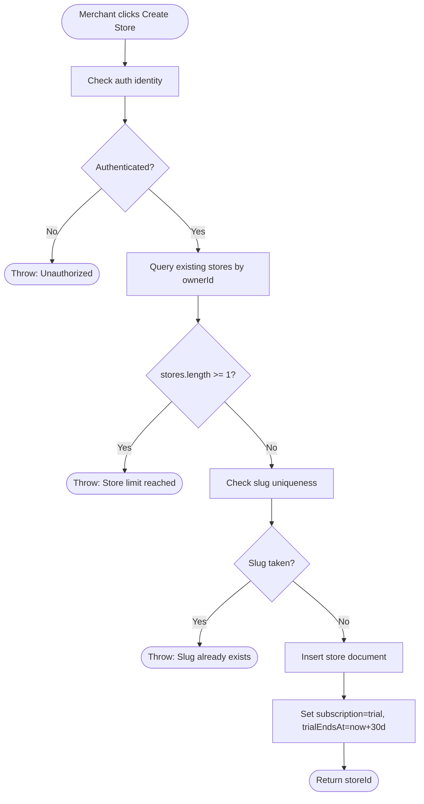
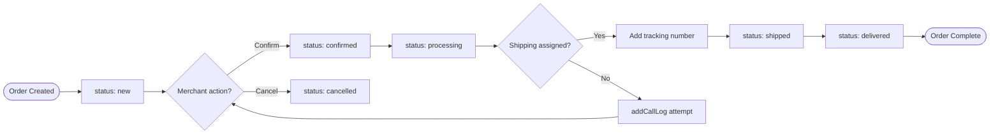
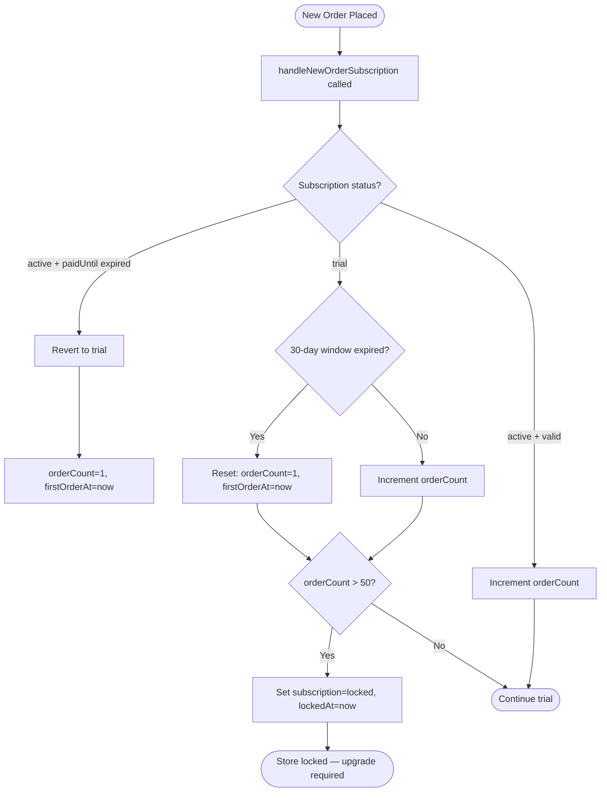
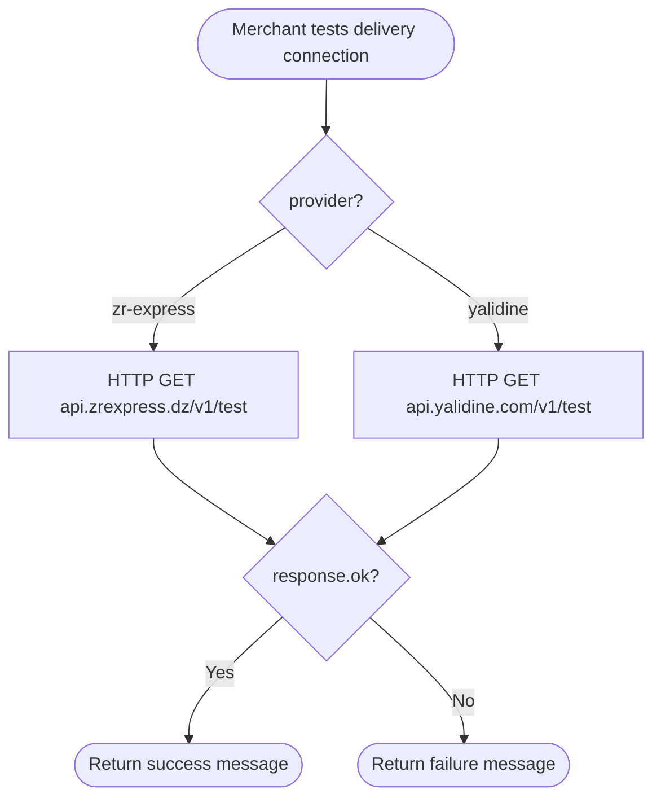

# 📦 Marlon Backend Wiki

> **For new Backend developers** — a comprehensive reference to understand, navigate, and contribute to the Marlon backend.

---

## 0. Introduction

**Marlon** is a multi-tenant SaaS platform built for Algerian entrepreneurs to create and manage **COD (Cash-on-Delivery) based online stores** with zero technical knowledge. The platform handles everything from store creation and product management to order lifecycle tracking, storefront customization, and subscription/billing state management.

### Tech Stack

| Layer | Technology |
|---|---|
| Backend Runtime | [Convex](https://convex.dev) (serverless, real-time) |
| Authentication | [Clerk](https://clerk.dev) (JWT-based via Convex auth adapter) |
| Database | Convex built-in document database (NoSQL) |
| File Storage | Convex Storage (S3-compatible) |
| Delivery Partners | ZR Express API, Yalidine API |
| Language | TypeScript |

### Backend File Map

```
convex/
├── schema.ts            # All table definitions & indexes
├── users.ts             # User sync, theme preferences
├── stores.ts            # Store CRUD, billing state machine, delivery pricing
├── products.ts          # Product CRUD, image resolution, reordering
├── orders.ts            # Order lifecycle, call logs, audit trail
├── siteContent.ts       # Storefront content (navbar, hero, footer), delivery integrations
├── auth.config.ts       # Clerk provider configuration
├── auth.ts              # Convex auth setup
├── convex.config.ts     # Convex platform config
└── _generated/          # Auto-generated types & server helpers (do not edit)
```

---

## 1. System Architecture

Marlon follows a **serverless, real-time backend architecture** powered by Convex. There is no traditional REST API server — all backend logic lives in Convex **functions** (queries, mutations, actions) that are called directly from the Next.js frontend via the Convex client SDK.

### Key Architectural Principles

- **Multi-tenancy**: Each `store` is isolated by `ownerId` (Clerk user subject). All queries are scoped per-store.
- **Real-time reactivity**: Convex queries are live-subscribed. Any mutation triggers automatic UI re-renders on all connected clients.
- **Authentication at the function level**: Every sensitive mutation/query calls `ctx.auth.getUserIdentity()` and asserts ownership before proceeding.
- **Billing State Machine**: Subscription lifecycle (`trial → active → locked`) is enforced server-side on every new order via `handleNewOrderSubscription`.
- **Soft deletes**: Products use `isArchived` flag. Orders in locked stores are cleaned up after 20 days via `cleanupLockedStoreOrders` (internal mutation).
- **Immutable array updates**: All array fields (timeline, callLog, adminNotes) are updated with spread patterns (`[...existing, newEntry]`) — never mutated in place.

### Function Types Used

| Type | Purpose | Can Call External APIs? |
|---|---|---|
| `query` | Read-only, live-subscribed | No |
| `mutation` | Read + Write to DB | No |
| `action` | External HTTP calls | Yes |
| `internalMutation` | Write, only callable by Convex scheduler | No |

---

## 2. High-Level Architecture Diagram



---

## 3. Use Case Diagram

```mermaid
usecaseDiagram
    actor Merchant
    actor Customer
    actor System

    rectangle "Marlon Platform" {
        usecase UC1 as "Register / Login"
        usecase UC2 as "Create Store"
        usecase UC3 as "Manage Products"
        usecase UC4 as "Customize Storefront"
        usecase UC5 as "Configure Delivery Pricing"
        usecase UC6 as "View & Manage Orders"
        usecase UC7 as "Update Order Status"
        usecase UC8 as "Log Call Attempt"
        usecase UC9 as "Browse Store"
        usecase UC10 as "Place Order (COD)"
        usecase UC11 as "Manage Subscription"
        usecase UC12 as "Connect Delivery Provider"
        usecase UC13 as "Cleanup Locked Store Data"
    }

    Merchant --> UC1
    Merchant --> UC2
    Merchant --> UC3
    Merchant --> UC4
    Merchant --> UC5
    Merchant --> UC6
    Merchant --> UC7
    Merchant --> UC8
    Merchant --> UC11
    Merchant --> UC12

    Customer --> UC9
    Customer --> UC10

    System --> UC13
```

---

## 4. Database Schema

All tables are defined in [`convex/schema.ts`](./convex/schema.ts). Convex uses a **document model** (similar to MongoDB). Every document automatically gets an `_id` (Convex ID) and `_creationTime`.

### `users`
| Field | Type | Notes |
|---|---|---|
| `clerkId` | `string` | Clerk user subject — **primary lookup key** |
| `email` | `string` | |
| `firstName` | `string?` | |
| `lastName` | `string?` | |
| `phone` | `string?` | |
| `theme` | `string?` | `"light"` or `"dark"` |
| `createdAt` | `number` | Unix timestamp |
| `updatedAt` | `number` | Unix timestamp |

**Indexes:** `clerkId`

---

### `stores`
| Field | Type | Notes |
|---|---|---|
| `ownerId` | `string` | Clerk subject of the owner |
| `name` | `string` | Display name |
| `slug` | `string` | URL-safe unique identifier (`/{slug}`) |
| `description` | `string?` | |
| `logo` | `string?` | Storage URL |
| `phone` | `string?` | |
| `address` | `string?` | |
| `wilaya` | `string?` | Algerian province |
| `status` | `string?` | `"active"` \| `"locked"` |
| `subscription` | `string?` | `"trial"` \| `"active"` \| `"locked"` |
| `orderCount` | `number?` | Orders in current billing window |
| `firstOrderAt` | `number?` | Start of 30-day trial window |
| `trialEndsAt` | `number?` | Trial expiry timestamp |
| `paidUntil` | `number?` | Active subscription expiry |
| `lockedAt` | `number?` | When the store was locked |
| `createdAt` | `number` | |
| `updatedAt` | `number` | |

**Indexes:** `ownerId`, `slug`

---

### `products`
| Field | Type | Notes |
|---|---|---|
| `storeId` | `string` | Reference to `stores._id` |
| `name` | `string` | |
| `description` | `string?` | |
| `basePrice` | `number` | Price in DZD |
| `oldPrice` | `number?` | Strikethrough price |
| `images` | `string[]?` | Array of storage IDs or URLs |
| `category` | `string?` | |
| `variants` | `Variant[]?` | See variant shape below |
| `isArchived` | `boolean?` | Soft delete flag |
| `sortOrder` | `number?` | Display order |
| `createdAt` | `number` | |
| `updatedAt` | `number` | |

**Variant shape:**
```ts
{ name: string, options: { name: string, priceModifier?: number }[] }
```

**Indexes:** `storeId`, `(storeId, category)`

---

### `orders`
| Field | Type | Notes |
|---|---|---|
| `storeId` | `string` | Reference to `stores._id` |
| `orderNumber` | `string` | Human-readable order ref |
| `customerName` | `string` | |
| `customerPhone` | `string` | |
| `customerWilaya` | `string` | Delivery province |
| `customerCommune` | `string?` | |
| `customerAddress` | `string?` | |
| `products` | `OrderProduct[]` | Snapshot of purchased items |
| `subtotal` | `number` | |
| `deliveryCost` | `number` | |
| `total` | `number` | |
| `deliveryType` | `string?` | `"home"` \| `"office"` |
| `status` | `string` | `new` \| `confirmed` \| `shipped` \| `delivered` \| `cancelled` \| etc. |
| `paymentStatus` | `string?` | `"pending"` \| `"paid"` |
| `callAttempts` | `number?` | Number of call attempts |
| `lastCallOutcome` | `string?` | |
| `lastCallAt` | `number?` | |
| `trackingNumber` | `string?` | Delivery tracking ref |
| `notes` | `string?` | Customer notes |
| `callLog` | `CallEntry[]?` | Full call history |
| `adminNotes` | `AdminNote[]?` | Merchant internal notes |
| `auditTrail` | `AuditEntry[]?` | Action history |
| `timeline` | `TimelineEntry[]?` | Status change history |
| `createdAt` | `number` | |
| `updatedAt` | `number` | |

**Indexes:** `storeId`, `(storeId, status)`, `orderNumber`

---

### `siteContent`
| Field | Type | Notes |
|---|---|---|
| `storeId` | `string` | Reference to `stores._id` |
| `section` | `string` | `"navbar"` \| `"hero"` \| `"footer"` \| `"deliveryIntegration"` |
| `content` | `any` | Section-specific JSON blob |
| `updatedAt` | `number` | |

**Indexes:** `storeId`, `(storeId, section)`

---

### `deliveryPricing`
| Field | Type | Notes |
|---|---|---|
| `storeId` | `string` | Reference to `stores._id` |
| `wilaya` | `string` | Algerian province name |
| `homeDelivery` | `number?` | Home delivery cost in DZD |
| `officeDelivery` | `number?` | Office/desk delivery cost |
| `updatedAt` | `number` | |

**Indexes:** `storeId`, `(storeId, wilaya)`

---

## 5. Entity Relationship Diagram (ERD)



---

## 6. Class Diagram

> Convex does not use classes per se, but the following diagram represents the logical module responsibilities and their relationships.



---

## 7. API Core Endpoints

All backend functions are accessed through the Convex client using `useQuery()` and `useMutation()` hooks. There are no HTTP endpoints — functions are addressed as `api.<module>.<functionName>`.

### Users (`api.users.*`)

| Function | Type | Args | Description |
|---|---|---|---|
| `getUserByClerkId` | query | `clerkId: string` | Fetch user by Clerk ID |
| `syncUser` | mutation | `clerkId, email, firstName?, lastName?, phone?` | Upsert user from Clerk webhook |
| `updateUserTheme` | mutation | `clerkId, theme` | Toggle light/dark theme |
| `deleteUser` | mutation | `clerkId` | Remove user on Clerk deletion |

### Stores (`api.stores.*`)

| Function | Type | Args | Description |
|---|---|---|---|
| `getStoreBySlug` | query | `slug: string` | Public — fetch store by URL slug |
| `getUserStores` | query | `userId: string` | Get all stores owned by user |
| `isSlugAvailable` | query | `slug: string` | Check slug uniqueness |
| `createStore` | mutation | `name, slug, description?, phone?, wilaya?` | Create store (max 1 per user) |
| `updateStore` | mutation | `storeId, name?, logo?, phone?, ...` | Update store settings |
| `handleNewOrderSubscription` | mutation | `storeId` | Advance billing state machine |
| `getStoreBillingStatus` | query | `storeId` | Trial/active/locked status |
| `updateDeliveryPricing` | mutation | `storeId, wilaya, homeDelivery?, officeDelivery?` | Upsert per-wilaya pricing |

### Products (`api.products.*`)

| Function | Type | Args | Description |
|---|---|---|---|
| `getProducts` | query | `storeId` | List active products |
| `searchProducts` | query | `storeId, searchQuery` | Text search across name & description |
| `createProduct` | mutation | `storeId, name, basePrice, ...` | Add new product |
| `updateProduct` | mutation | `productId, name?, basePrice?, images?, ...` | Edit product |
| `archiveProduct` | mutation | `productId` | Soft delete (sets `isArchived=true`) |
| `reorderProducts` | mutation | `storeId, productIds[]` | Batch update `sortOrder` |

### Orders (`api.orders.*`)

| Function | Type | Args | Description |
|---|---|---|---|
| `createOrder` | mutation | `storeId, customerName, products[], subtotal, ...` | Place new order (status = `new`) |
| `getOrders` | query | `storeId` | List all orders for a store |
| `getOrdersByStatus` | query | `storeId, status` | Filter by order status |
| `updateOrderStatus` | mutation | `orderId, status, note?` | Transition order state + append timeline |
| `addCallLog` | mutation | `orderId, outcome, notes?` | Record a call attempt |
| `addAdminNote` | mutation | `orderId, text` | Add internal merchant note |
| `updateTrackingNumber` | mutation | `orderId, trackingNumber` | Set shipping tracking ref |
| `deleteOrder` | mutation | `orderId` | Permanently delete order |

### Site Content (`api.siteContent.*`)

| Function | Type | Args | Description |
|---|---|---|---|
| `getSiteContentResolved` | query | `storeId, section` | Fetch section with resolved storage URLs |
| `updateSiteContent` | mutation | `storeId, section, content` | Generic upsert any section |
| `setNavbarStyles` | mutation | `storeId, background?, textColor?` | Set navbar appearance |
| `setHeroStyles` | mutation | `storeId, title?, ctaText?, layout?, ...` | Set hero section |
| `setLogoAndSyncFooter` | mutation | `storeId, logoStorageId` | Upload logo → sync navbar + footer |
| `initializeSiteContent` | mutation | `storeId` | Seed default navbar/hero/footer |
| `generateUploadUrl` | mutation | `{}` | Get presigned Convex storage upload URL |
| `testDeliveryConnection` | action | `storeId, provider, apiKey, apiToken` | Ping ZR Express or Yalidine API |
| `bulkSetDeliveryPricing` | mutation | `storeId, pricing[]` | Batch upsert wilaya delivery costs |

---

## 8. Sequence Diagrams

### 8.1 Customer Places an Order



---

### 8.2 Merchant Updates Order Status



---

### 8.3 User Registration / Sync via Clerk Webhook



---

### 8.4 Billing State Machine on New Order

```mermaid
sequenceDiagram
    participant CV as Convex: handleNewOrderSubscription
    participant DB as Convex DB

    CV->>DB: stores.get(storeId)
    alt subscription == "active" AND paidUntil < now
        CV->>DB: patch → { subscription: "trial", orderCount: 1, firstOrderAt: now }
        CV-->>: Return { action: "reverted_to_trial" }
    else subscription == "trial" AND firstOrderAt set
        CV->>CV: Check if 30-day window expired
        alt Window expired
            CV->>DB: patch → { orderCount: 1, firstOrderAt: now }
        else Still in window
            CV->>DB: patch → { orderCount: orderCount + 1 }
        end
        alt orderCount > 50
            CV->>DB: patch → { subscription: "locked", lockedAt: now }
        end
    else subscription == "active"
        CV->>DB: patch → { orderCount: orderCount + 1 }
    end
```

---

## 9. Data Flow

### 9.1 Product Image Upload Flow

```
Merchant selects image
    │
    ▼
Frontend calls: mutation generateUploadUrl()
    │
    ▼
Convex returns a presigned upload URL (ctx.storage.generateUploadUrl)
    │
    ▼
Frontend HTTP PUTs image directly to Convex Storage
    │
    ▼
Convex returns storageId (e.g. "kg2abc123...")
    │
    ▼
Frontend calls: mutation createProduct/updateProduct({ images: [storageId] })
    │
    ▼
On read: query getProducts() calls ctx.storage.getUrl(storageId)
         → returns a temporary signed CDN URL for display
```

### 9.2 Storefront Public Access Flow

```
Customer visits marlon.dz/{store-slug}
    │
    ▼
Next.js: useQuery(api.stores.getStoreBySlug, { slug })
    │
    ▼
Convex returns store document (no auth required)
    │
    ▼
Next.js: useQuery(api.products.getProducts, { storeId })
    │
    ▼
Convex resolves product images via ctx.storage.getUrl()
    │
    ▼
Page renders with live-subscribed product data
```

### 9.3 Order Status Mutation Flow

```
Merchant clicks "Confirm Order"
    │
    ▼
useMutation(api.orders.updateOrderStatus)
    │
    ▼
Convex: assertOrderOwnership → fetch order → fetch store → compare ownerId
    │
    ▼
Convex: patch order { status, timeline: [...existing, newEntry] }
    │
    ▼
Convex DB emits change event
    │
    ▼
All useQuery(getOrders) subscribers auto-refresh (real-time)
```

---

## 10. Activity Diagrams

### 10.1 Store Creation Activity



---

### 10.2 Order Lifecycle Activity



---

### 10.3 Billing State Machine Activity



---

### 10.4 Delivery Integration Test Activity



---

## Appendix: Authorization Model

Every write operation in Marlon follows a consistent ownership chain:

```
ctx.auth.getUserIdentity()
    └── identity.subject  (Clerk user ID)
            └── stores.ownerId === identity.subject  ✅
                    └── products.storeId → store.ownerId === identity.subject  ✅
                    └── orders.storeId → store.ownerId === identity.subject  ✅
```

- If the chain breaks at any point, the function throws `"Forbidden"` or `"Unauthorized"`.
- Public queries (e.g., `getStoreBySlug`, `getProducts`) do **not** require auth — they serve the customer-facing storefront.

---

## Appendix: Billing Constants

| Constant | Value | Description |
|---|---|---|
| `MAX_STORES_PER_USER` | `1` | Default store limit (Agency Mode lifts this) |
| `TRIAL_WINDOW_DAYS` | `30` | Days per billing window |
| `MAX_ORDERS_BEFORE_LOCK` | `50` | Orders before store is locked |
| `LOCKED_ORDER_RETENTION_DAYS` | `20` | Days to retain orders after locking |

---

*Last updated: March 2026 — maintained by the Marlon engineering team.*
