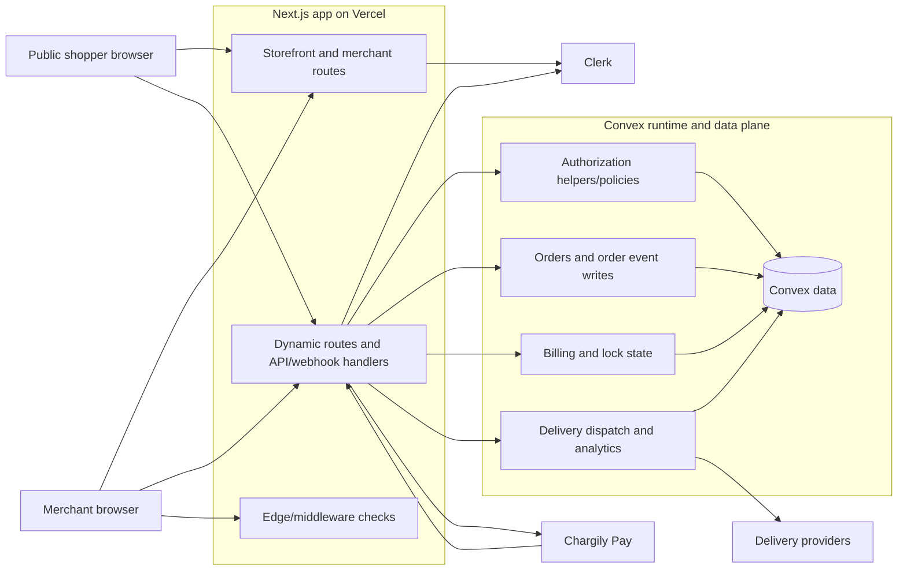
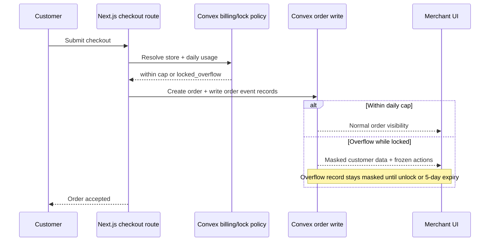

# Architecture

Truth-first architecture reference for Marlon MVP. This document separates live implementation from policy constraints and target-state design so diagrams and claims do not overstate what is already shipped.

Status labels used here:
- `Current`: live in code now.
- `Partial`: some pieces exist, but the full behavior is not complete.
- `Planned`: intended architecture, not yet fully implemented.
- `Policy-locked`: business/security rule that should be treated as fixed even if implementation is incomplete.
- `Needs verification`: likely true but should be rechecked in code before relying on it operationally.

## 1) Architecture Snapshot

### Current runtime reality

- `Current`: Single Next.js application serves both public storefront and merchant/admin UI.
- `Current`: Convex is the primary backend/data plane for app logic and data.
- `Current`: Clerk provides authentication context.
- `Current`: Storefront is client-rendered in live code; this is not currently ISR/static in production behavior.
- `Current`: Auth enforcement is primarily owner-based and store-scoped close to feature code, not a fully centralized policy layer.
- `Current`: Live order data is split across `orders`, `orderDigests`, `orderTimelineEvents`, and `orderCallEvents` rather than one canonical audit table.
- `Current`: Delivery analytics events and rollups exist in the live schema, though surrounding delivery workflow architecture is still only partial.
- `Partial`: Chargily billing/unlock flow exists, but runtime lock/billing behavior does not yet fully match the planned `5/day` overflow model end to end.
- `Partial`: Delivery integration exists in part, but async queue/retry/DLQ architecture is not fully live.
- `Partial`: Webhook verification and idempotency hardening are not yet complete enough to describe as finished.
- `Partial`: Ops, monitoring, and reliability controls exist unevenly and should not be treated as full target-state coverage.

### Policy-locked constraints

- `Policy-locked`: Multi-tenant isolation is by store.
- `Policy-locked`: Store slugs must be globally unique and protected by a reserved-word denylist.
- `Policy-locked`: Merchant roles are `owner`, `admin`, and `staff`; platform break-glass access is exceptional only.
- `Policy-locked`: Owner transfer/removal requires explicit owner-confirmation style governance; admin-only owner removal is forbidden.
- `Policy-locked`: Locked/overflow behavior must not expose masked customer data before unlock.
- `Policy-locked`: Customer-facing checkout should not surface merchant lock state.
- `Policy-locked`: Delivery credentials belong in dedicated secret storage, not generic content blobs.

### Target state

- `Planned`: Public catalog/product routes move to ISR/static or equivalent cache-friendly rendering.
- `Planned`: Auth converges on a centralized Convex policy layer used by all protected operations.
- `Planned`: Billing/lock enforcement fully matches the `5/day`, `Africa/Algiers` overflow model.
- `Planned`: Delivery dispatch runs through async jobs with retry, DLQ, and replay tooling.
- `Planned`: Payment webhooks enforce signature verification, replay protection, and idempotent processing consistently.
- `Planned`: Monitoring, alerting, synthetic checks, and backup/restore posture become explicit operational guarantees rather than aspirations.

## 2) System Context

Diagram key: this shows the intended runtime shape. Boxes and links include both live and planned components; see status notes below before treating every edge as production reality.

- `Current`: Next.js, Convex, Clerk, Chargily, and delivery-provider integration points exist in the app architecture.
- `Current`: Dynamic routes and API/webhook handlers are part of the runtime.
- `Partial`: Middleware and authorization helpers exist, but not yet as a uniformly enforced policy system.
- `Partial`: Delivery integration reaches providers in some flows, but the service boundary is not yet fully asynchronous/retriable.
- `Current`: Convex contains live order-event and delivery-analytics structures even though some higher-level service boundaries are still target-state.
- `Planned`: Treat the `auth`, `billing`, and `delivery` boxes as target service boundaries, not proof of full separation in live code.

## 3) Runtime Components

- Next.js web app
  - `Current`: Public storefront and merchant UI share one app shell.
  - `Current`: Storefront rendering is primarily client-side in live code.
  - `Planned`: Catalog/product discovery becomes ISR/static or similar cached rendering where safe.
- API/webhook layer
  - `Current`: Accepts checkout, billing callback, and delivery-related requests.
  - `Partial`: Validation exists in parts of the stack.
  - `Partial`: Signature verification and idempotency should not be assumed complete on all webhook paths.
- Authorization
  - `Current`: Access control is mainly enforced through owner-based store checks.
  - `Partial`: Some helper abstractions exist.
  - `Planned`: One central policy layer governs all protected reads, writes, and actions.
- Orders and audit
  - `Current`: Orders are persisted in Convex.
  - `Current`: Live order-related history is split across `orderDigests`, `orderTimelineEvents`, and `orderCallEvents`.
  - `Partial`: Event recording exists in meaningful parts of the flow, but this document should not imply a single complete immutable `orderAudit` architecture is already live everywhere.
- Billing and lock state
  - `Partial`: Unlock/payment behavior exists.
  - `Partial`: Live lock behavior does not yet fully implement the target `5/day` overflow lifecycle exactly as specified.
- Delivery integration
  - `Partial`: Provider integration and merchant dispatch flows exist.
  - `Partial`: Some delivery metadata/credentials handling exists.
  - `Current`: Delivery analytics events and rollup-style data exist in the live schema.
  - `Planned`: Async dispatch queue, retries, and DLQ are still target-state architecture.
- Ops/reliability layer
  - `Current`: Basic platform/runtime hosting exists.
  - `Needs verification`: exact monitoring, alerting, backup, and restore coverage should be rechecked before being relied on operationally.

## 4) Request and Data Flows

### A) Storefront order creation

1. `Current`: Shopper loads storefront in the Next.js app.
2. `Current`: Checkout submits customer/order payload to dynamic backend logic.
3. `Current`: Backend resolves the target store from routing context.
4. `Partial`: Billing/lock checks may run during order creation, but live behavior is not yet the full planned `5/day` overflow model in all cases.
5. `Current`: Order is written to Convex, with related history/event data split across multiple order-event tables.
6. `Partial`: Merchant-visible masking/freeze behavior exists conceptually and in part of the implementation, but should not be documented as perfectly complete until verified end to end.

### B) Overflow lock and freeze behavior

Diagram key: this sequence shows the intended business flow. Live code only partially matches it today.

- `Policy-locked`: Customer checkout should still succeed even when merchant lock/overflow rules apply.
- `Policy-locked`: Merchant-side masked/frozen behavior is the required business rule for protected overflow records.
- `Partial`: The exact `5/day` quota, `Africa/Algiers` reset handling, unlock restoration, and 5-day expiry path should be treated as target behavior unless confirmed in code.

### C) Unlock payment webhook

1. `Current`: Store admin can initiate payment/unlock-related flow.
2. `Current`: Chargily sends webhook callbacks into backend routes.
3. `Partial`: Success handling updates billing/unlock state in some form.
4. `Partial`: Signature verification, replay-window defense, and idempotent receipt handling are not yet hardened enough to describe as complete.
5. `Planned`: Verified payment events become the sole source of truth for unlock activation and durable event recording.

### D) Delivery dispatch

1. `Current`: Merchant can trigger delivery dispatch in at least part of the order workflow.
2. `Current`: Provider-specific integration logic exists.
3. `Partial`: Credential loading and adapter/service boundaries exist unevenly or are still being formalized.
4. `Planned`: Dispatch moves to async workers/queues with retry and DLQ rather than depending on direct request-time processing.
5. `Planned`: Canonical analytics and normalized terminal delivery events become consistent across providers.

## 5) Authorization and Tenant Isolation

- `Current`: Store isolation is enforced primarily through store-scoped lookups and owner-based checks.
- `Current`: Slug is a routing identifier; store-scoped data should still resolve to a single store boundary.
- `Partial`: Role-aware permissions exist, but enforcement is not yet a complete centralized policy layer.
- `Policy-locked`: No feature should bypass store ownership or equivalent store-scoped authorization checks for protected data.
- `Policy-locked`: `owner` has store authority; `admin` cannot remove/transfer the owner unilaterally; `staff` has limited operational access.
- `Policy-locked`: Break-glass platform intervention must be exceptional and auditable.
- `Planned`: Locked-state visibility/masking becomes a backend policy output everywhere, not a behavior enforced inconsistently by feature code.

## 6) Data Ownership Boundaries

- `Current`: Convex stores canonical app data for stores, products/content, orders, owner-linked identity data, and delivery analytics.
- `Current`: Live order records are distributed across `orders`, `orderDigests`, `orderTimelineEvents`, and `orderCallEvents`.
- `Partial`: These order/event tables provide meaningful history coverage, but this doc should not claim a universally complete append-only audit model yet.
- `Policy-locked`: Delivery secrets must live outside generic content blobs and remain write-only after save from the UI perspective.
- `Policy-locked`: Billing/webhook processing needs durable event-receipt/idempotency evidence once hardening is complete.
- `Planned`: Ownership-transfer evidence, immutable governance events, durable webhook receipts, and retention/anonymization boundaries become explicit schema-level guarantees.

## 7) Reliability and Operations

- `Current`: Vercel/Next.js plus Convex provide the baseline hosted runtime.
- `Partial`: Some request validation and anti-abuse protections may exist, but this should not be read as comprehensive rate-limiting/fraud-defense coverage.
- `Partial`: Operational visibility exists only to the extent already wired in code/platform accounts; this document does not certify full monitoring coverage.
- `Needs verification`: environment isolation, alerting, uptime probes, synthetic checkout tests, backup frequency, and restore objectives should be validated before being treated as committed ops guarantees.
- `Planned`: Delivery retries, DLQ replay, hardened webhook resilience, and explicit monitoring/restore targets are target-state reliability controls.

## 8) Performance Strategy

- `Current`: App performance depends mainly on the current client-rendered storefront plus Convex-backed dynamic operations.
- `Current`: Admin experiences can use realtime/data-subscription patterns where implemented.
- `Planned`: Catalog/product discovery routes move to cache-friendly rendering to reduce storefront latency.
- `Planned`: External provider work should be removed from hot user-facing paths where possible and pushed to async processing.
- `Needs verification`: index coverage, p95 protections under abuse, and synthetic performance guardrails should be confirmed in code and infrastructure before promising them.

## 9) Open Gaps That Matter

- `Gap`: Centralized authorization/policy enforcement is not finished; current reality is mostly owner-based store checks.
- `Gap`: Storefront rendering strategy in live code is client-rendered, not the previously documented ISR/static model.
- `Gap`: Billing/lock runtime behavior only partially matches the full planned `5/day` overflow lifecycle.
- `Gap`: Delivery queue/retry/DLQ architecture is still target-state.
- `Gap`: Webhook verification and idempotency need further hardening.
- `Gap`: Ops/reliability claims need code-and-platform verification before they can be treated as committed architecture.
