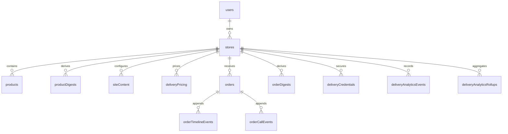
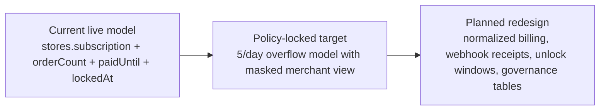

# Data Models

Truth-first data reference for Marlon MVP. This document separates live Convex schema from policy targets and redesign ideas so it does not overstate what exists today.

Status labels used here:
- `Current`: live in `convex/schema.ts` now.
- `Partial`: some structure exists, but the full target behavior does not.
- `Planned`: intended schema/design, not live yet.
- `Policy-locked`: business rule treated as fixed even if implementation is incomplete.
- `Needs verification`: likely true, but should be rechecked before relying on it.

## 1) Live Schema Snapshot

- `Current`: Live tables are `users`, `stores`, `products`, `orders`, `orderDigests`, `orderTimelineEvents`, `orderCallEvents`, `productDigests`, `siteContent`, `deliveryPricing`, `deliveryCredentials`, `deliveryAnalyticsEvents`, and `deliveryAnalyticsRollups`.
- `Current`: The live model is mostly owner-centric. `stores.ownerId` is the main tenant/control link.
- `Current`: There is no live `storeMemberships`, `ownerTransferRequests`, `billingSubscriptions`, `unlockWindows`, `webhookReceipts`, `queueJobs`, `blocklistEntries`, or `reputationSignals` table.
- `Partial`: Billing/lock state lives mainly on `stores` via trial/subscription/order-count fields, not via a full normalized billing model.
- `Needs verification`: Some ID shapes are inconsistent across tables; several `storeId` fields are plain strings, while some newer tables use `v.id("stores")` or `v.id("orders")` references.

Live entity map:

## 2) Current Core Tables

### `users` - `Current`

Purpose: authenticated user profile keyed to Clerk.

- Key fields: `clerkId`, `email`, optional `firstName`, `lastName`, `phone`, `theme`, `createdAt`, `updatedAt`
- Indexes: `clerkId`
- Reality note: no live platform-role, membership, trust, or lifecycle-retention fields

### `stores` - `Current`

Purpose: canonical store record and current commercial state.

- Key fields: `ownerId`, `name`, `slug`, optional profile/contact fields, `status`
- Current billing/lock fields: `subscription`, `orderCount`, `firstOrderAt`, `trialEndsAt`, `paidUntil`, `lockedAt`
- Indexes: `ownerId`, `slug`, `subscription`
- Reality note: this is the live billing/lock source of truth today; it is not the planned overflow-lock schema

### `products` - `Current`

Purpose: catalog products with optional variants.

- Key fields: `storeId`, `name`, optional `description`, `basePrice`, optional `oldPrice`, `images`, `category`, `variants`, `isArchived`, `sortOrder`, timestamps
- Variant shape: array of variant groups with `name` and `options[{ name, priceModifier? }]`
- Indexes: `storeId`, `category`, `storeArchivedSort`, `storeCategoryArchivedSort`
- Reality note: live fields differ materially from the older `slug`/published/inventory-style documentation

### `orders` - `Current`

Purpose: operational order record with customer, line items, delivery, notes, and some embedded history.

- Key fields: `storeId`, `orderNumber`, customer fields (`customerName`, `customerPhone`, `customerWilaya`, optional commune/address), `products[]`, `subtotal`, `deliveryCost`, `total`, `status`
- Optional operations fields: `paymentStatus`, call metrics, delivery/tracking fields, `notes`
- Embedded history still present: optional `callLog[]`, `auditTrail[]`, `timeline[]`, admin-note fields
- Indexes: `storeId`, `storeCreatedAt`, `status`, `orderNumber`, `storeOrderNumber`, `storeUpdatedAt`
- Reality note: live orders are not modeled with masked-overflow snapshots, retention markers, or normalized audit-only history yet

## 3) Current Supporting / Derived / Event Tables

### Order-facing tables

- `orderDigests` - `Current`: denormalized order list/read model with headline customer, total, status, provider, and product-summary fields; indexed by `orderId`, store/update, store/status/update, and store/order number
- `orderTimelineEvents` - `Current`: per-order timeline events with `status`, optional `note`, `createdAt`; indexed by order/date and store/date
- `orderCallEvents` - `Current`: per-order call outcomes with optional notes; indexed by order/date and store/date

### Product-facing tables

- `productDigests` - `Current`: denormalized product read model with `productId`, `storeId`, `name`, pricing, `primaryImage`, `category`, archive state, and sort order

### Store config / delivery tables

- `siteContent` - `Current`: flexible per-store content by `section`, with `content` stored as `any`
- `deliveryPricing` - `Current`: per-store, per-wilaya pricing using `homeDelivery` and `officeDelivery`; this is simpler than the previously documented zone-matrix target
- `deliveryCredentials` - `Current`: encrypted credentials with `storeId`, `provider`, `algorithm`, `ciphertextHex`, `ivHex`, timestamps
- `Needs verification`: `deliveryCredentials` currently omits an `authTag` field in schema even though AES-GCM normally expects one

### Delivery analytics tables

- `deliveryAnalyticsEvents` - `Current`: event stream for delivery outcomes with `eventType`, `provider`, optional `region`, `trackingNumber`, `reason`, `source`, `createdAt`
- `deliveryAnalyticsRollups` - `Current`: daily aggregate counters by store/day/provider/region with `attempted`, `dispatched`, `delivered`, `failed`, `rts`, `completed`, `updatedAt`
- `Partial`: these analytics tables are live even though the full async dispatch/queue architecture is not

## 4) Policy-Locked Model Targets

- `Policy-locked`: Store isolation is by store boundary, even though live authorization is mostly owner-based today.
- `Policy-locked`: Store slugs must be globally unique and protected by reserved-word policy.
- `Policy-locked`: Merchant roles are `owner`, `admin`, and `staff`; owner transfer/removal needs explicit owner-confirmation governance.
- `Policy-locked`: Locked/overflow behavior must not expose protected customer data before unlock.
- `Policy-locked`: Customer checkout should still succeed even when merchant lock rules apply.
- `Policy-locked`: Delivery credentials belong in dedicated secret storage, not generic site content.

Policy target lifecycle:

## 5) Planned Tables / Redesigns

- `Planned`: `storeMemberships` for role-aware store access beyond a single owner link
- `Planned`: governance tables such as `ownerTransferRequests` for auditable owner transfer/removal workflows
- `Planned`: normalized billing tables such as `billingSubscriptions`, `unlockWindows`, and `webhookReceipts`
- `Planned`: queue/worker tables for delivery dispatch retries and dead-letter handling
- `Planned`: explicit fraud/risk tables such as blocklists and reputation signals
- `Planned`: tighter canonical event modeling so order history no longer depends on a mix of embedded arrays plus side tables

Do not treat these as live schema. They are target-state design directions only.

## 6) Biggest Live-vs-Target Gaps

- `Gap`: Many previously documented tables were aspirational and do not exist in live Convex schema.
- `Gap`: Live billing/lock behavior is trial/subscription + order-count based, not the full `5/day` `Africa/Algiers` overflow/unlock/delete model.
- `Gap`: Live order history is split across `orders`, `orderDigests`, `orderTimelineEvents`, and `orderCallEvents`, with some history still embedded inside `orders`.
- `Gap`: Delivery pricing is currently per-wilaya home/office pricing, not the broader planned zone-rule matrix.
- `Gap`: Authorization data is still mostly owner-centric; do not assume live memberships, delegated roles, or governance workflows.
- `Gap`: Field names in live schema differ from older docs in several important places, especially `users`, `stores`, `products`, and `orders`.
