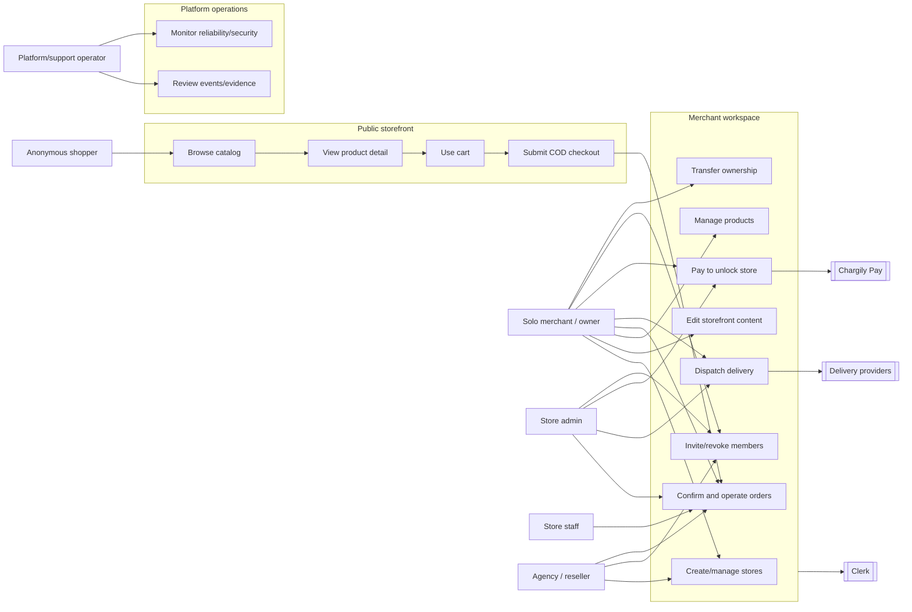
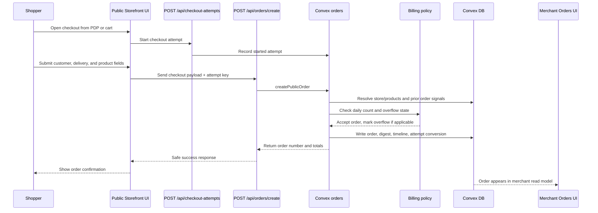
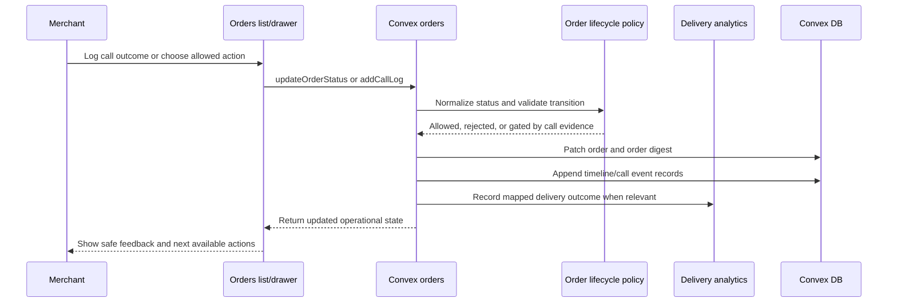
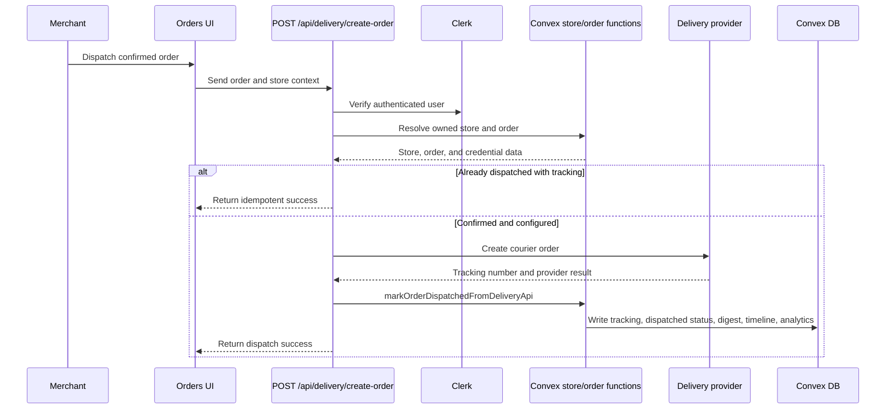
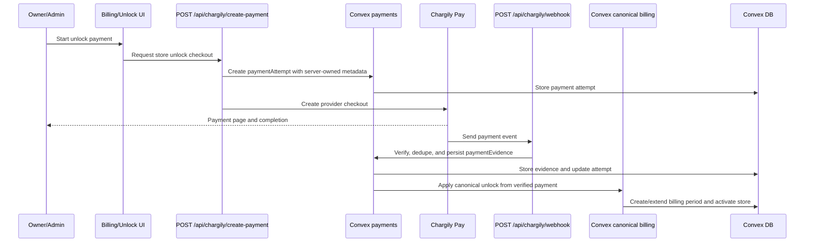
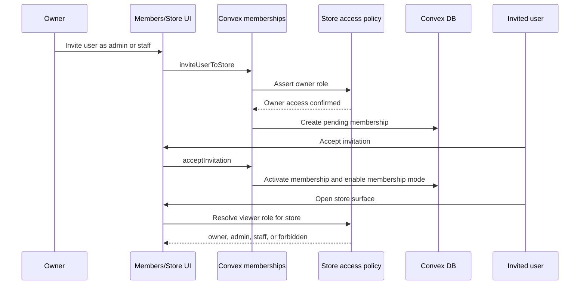
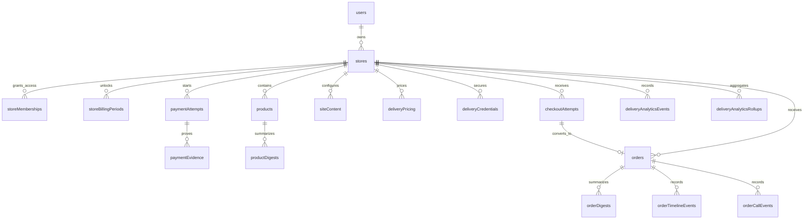

# Information System Design

Truth-first information-system design reference for Marlon. This document identifies actors, use cases, sequence flows, and the conceptual data model behind the full platform. It is not a replacement for `context/technical/ARCHITECTURE.md`, `context/technical/DATA_MODELS.md`, or `context/technical/API_CONTRACTS.md`; it connects those references into one system-design view.

Status labels used here:
- `Current`: present in the live repo or already completed in task history.
- `Partial`: present in parts of the product, but not complete or uniform.
- `Planned`: target direction, not safe to treat as fully live yet.
- `Policy-locked`: fixed product or governance rule even if implementation still needs hardening.

## 1) System Boundary

Marlon is a multi-tenant SaaS for Algerian COD-first ecommerce. The information system includes:

- `Current`: Next.js App Router routes for the public storefront, merchant workspace, orders, editor, and API boundaries.
- `Current`: Convex as the main backend, data store, realtime query/mutation layer, and tenant-rule enforcement location.
- `Current`: Clerk as the authentication provider and identity source.
- `Current`: Chargily Pay as the active payment provider path for store unlocks, with provider abstraction present.
- `Current`: ZR Express and Yalidine as supported delivery-provider integrations.
- `Partial`: delivery queue/retry/DLQ, least-privilege public read contracts, and platform support tooling are not complete target-state systems.

## 2) Actor Identification

### Human actors

| Actor                       | Role in the system              | Main permissions / interactions                                                                                                        |
| --------------------------- | ------------------------------- | -------------------------------------------------------------------------------------------------------------------------------------- |
| Anonymous shopper           | Public buyer placing COD orders | Browse public store, view product detail, use cart, submit checkout, receive safe order result.                                        |
| Solo merchant / store owner | Primary SaaS customer           | Create stores, manage products/content/settings, operate orders, configure delivery, invite members, transfer ownership, unlock store. |
| Store admin                 | Delegated operator              | Operate store surfaces allowed by role, invite/manage lower roles where implemented, pay to unlock store.                              |
| Store staff                 | Restricted operator             | Assist with store/order operations where role-aware access is wired.                                                                   |
| Agency owner / reseller     | Multi-store operator            | Own multiple stores directly or operate client-owned stores through invitations.                                                       |
| Platform/support operator   | Exceptional maintainer role     | Investigate incidents through operational data and context; no v1 super-admin product surface is in scope.                             |

### External system actors

| Actor | Purpose | Integration status |
|---|---|---|
| Clerk | Authentication and user identity | `Current`: Google OAuth and Convex auth bridge. |
| Chargily Pay | Store unlock checkout and webhook callbacks | `Current`: payment attempts/evidence tables and webhook route exist; trust hardening should be verified per release. |
| Delivery providers | Courier order creation and delivery status signals | `Current`: ZR Express and Yalidine integration paths exist; broader queue/retry architecture is planned. |
| Vercel | Hosting/runtime for Next.js app | `Current`: app hosting target. |
| Convex Cloud | Backend runtime and database | `Current`: primary data and function plane. |

## 3) Use-Case Diagram

- `Current`: anonymous shopper, merchant, owner/admin/staff membership, Clerk, Convex, payment, and delivery provider actors all have live representations.
- `Partial`: exact role coverage still varies by feature surface and must be verified before claiming complete role-based authorization everywhere.
- `Planned`: platform support remains operational, not a v1 super-admin product module.

## 4) Sequence Diagrams

### A) Public Checkout And Order Creation

- `Current`: `POST /api/orders/create` calls a public Convex order path and computes trusted totals server-side.
- `Current`: `checkoutAttempts` records started/submitted/converted/abandoned/recovered lifecycle data.
- `Policy-locked`: customer-facing order acceptance must not reveal merchant lock state.

### B) Merchant COD Order Lifecycle

- `Current`: confirmation requires answered-call evidence.
- `Current`: status, call, note, dispatch, provider sync, COD reconciliation, and bulk updates write normalized timeline metadata for new events.
- `Partial`: embedded order history still exists beside normalized event tables.

### C) Delivery Dispatch From Orders

- `Current`: successful dispatch side effects are owned by the server and Convex mutation path, not by a follow-up client-side status mutation.
- `Current`: unsupported providers and missing credentials fail closed with safe merchant feedback.
- `Partial`: dispatch is synchronous; durable queue, retry, and DLQ behavior are target-state architecture.

### D) Billing Unlock And Webhook Evidence

- `Current`: `paymentAttempts`, `paymentEvidence`, and `storeBillingPeriods` are live schema tables.
- `Policy-locked`: only verified server-side payment evidence should unlock a store.
- `Partial`: provider abstraction and operational monitoring should still be verified before treating the payment system as complete across every provider.

### E) Store Membership And Agency Access

- `Current`: owner bootstrap, invite, accept, revoke, active role lookup, and ownership transfer functions exist.
- `Policy-locked`: owner transfer requires the new owner to be an active member; owner access cannot be revoked like normal staff/admin access.
- `Partial`: some legacy owner-based paths still exist and should be migrated carefully toward centralized store-access helpers.

## 5) Conceptual Database Model

Convex is a document database, so this ER diagram is conceptual rather than SQL DDL. It shows the main live relationships from `convex/schema.ts`.

### Live table groups

- `Current`: identity and tenancy: `users`, `stores`, `storeMemberships`.
- `Current`: billing and unlock: `storeBillingPeriods`, `paymentAttempts`, `paymentEvidence`, plus compatibility billing fields on `stores`.
- `Current`: catalog and storefront: `products`, `productDigests`, `siteContent`, `deliveryPricing`.
- `Current`: checkout and orders: `checkoutAttempts`, `orders`, `orderDigests`, `orderTimelineEvents`, `orderCallEvents`.
- `Current`: delivery integration and analytics: `deliveryCredentials`, `deliveryAnalyticsEvents`, `deliveryAnalyticsRollups`.
- `Partial`: several `storeId` references are still strings while newer tables use Convex `Id<"stores">`; docs and implementations should avoid pretending every relationship is uniformly typed.
- `Planned`: `ownerTransferRequests`, durable queue jobs, dead-letter records, explicit blocklist/reputation tables, and richer governance/event tables are not live schema tables.

## 6) Data Boundaries And Integrity Rules

- `Policy-locked`: store isolation is the tenant boundary for all merchant data.
- `Current`: public storefront reads intentionally expose catalog/content data without authentication.
- `Partial`: some public reads still return broad records instead of narrowed public DTOs.
- `Current`: protected order, product, delivery, billing, and membership mutations should perform server-side store access checks.
- `Current`: order list performance uses `orderDigests`; product list performance uses `productDigests`.
- `Current`: delivery credentials live in a dedicated encrypted table and should not be stored in generic site content.
- `Current`: payment intent, payment proof, and unlock window are separated into `paymentAttempts`, `paymentEvidence`, and `storeBillingPeriods`.
- `Policy-locked`: payment success is not trusted unless verified and recorded through server-side evidence.
- `Partial`: delivery dispatch still lacks durable async queue/retry/DLQ storage.

## 7) Major System Gaps

- `Partial`: role-aware access exists, but not every historical owner-only path should be assumed fully centralized.
- `Partial`: public storefront rendering is client-side snapshot behavior, not a fully cache-optimized SSR/ISR catalog.
- `Partial`: delivery dispatch works through request-time provider calls; queueing and replay tooling remain target state.
- `Partial`: checkout-attempt tracking exists, but merchant-facing abandoned/recovered lead workflows remain incomplete.
- `Planned`: super-admin control plane, custom domains, native mobile apps, advanced analytics, marketing suite, inventory management, customer accounts, and public merchant API are outside v1.
