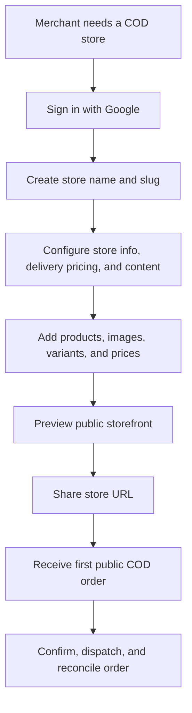
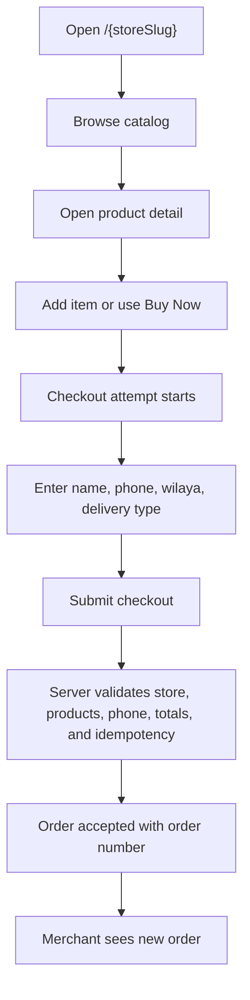
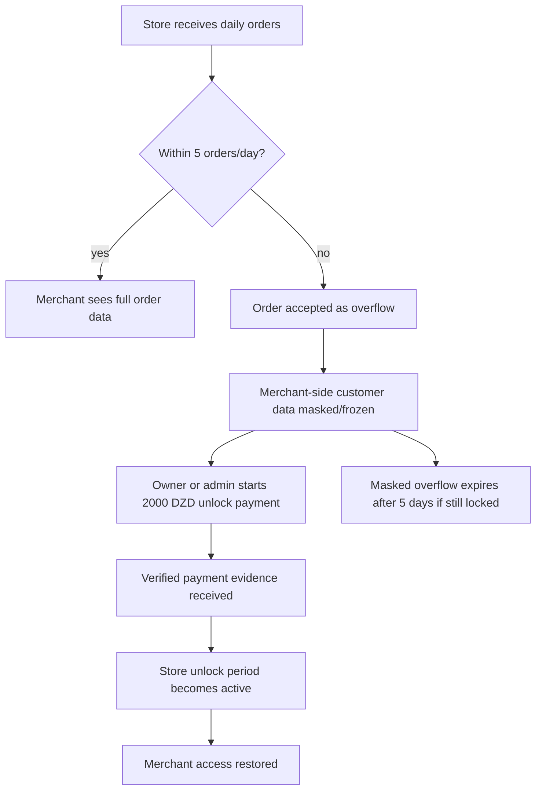
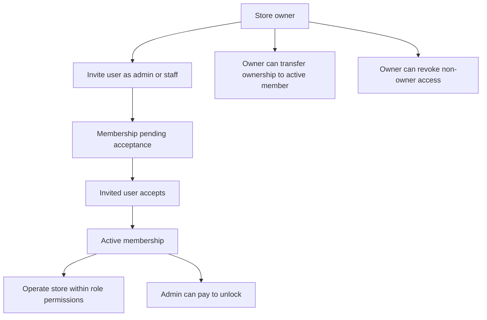

# User Experience

Truth-first UX reference for Marlon. This document describes the user personas, scenarios, journeys, and product flows that shape the full platform experience. It should be read with `context/project/OVERVIEW.md`, `context/project/SCOPE.md`, `context/design/UX_PATTERNS.md`, and the feature docs in `context/features/`.

Status labels used here:
- `Current`: present in the live repo or already completed in task history.
- `Partial`: present in parts of the product, but not complete or uniform.
- `Planned`: target direction, not safe to treat as fully live yet.
- `Policy-locked`: fixed product or governance rule even if implementation still needs hardening.

## 1) Experience Snapshot

- `Current`: Marlon serves two main experiences from one Next.js app: a public storefront for anonymous shoppers and a merchant workspace for authenticated store operators.
- `Current`: Public shoppers can browse a store catalog, open product details, use a cart, and submit real cash-on-delivery orders without authentication.
- `Current`: Merchants can create stores, manage products/content, operate COD orders, log call outcomes, dispatch confirmed orders to supported couriers, and review lifecycle history.
- `Current`: Store access foundations include owner, admin, and staff membership records, invitations, ownership transfer, and admin unlock permission.
- `Current`: Billing policy is anchored around `5 orders/day`, masked overflow records, `2000 DZD / store / month` unlocks, and verified payment evidence.
- `Partial`: Some UX documentation and feature docs still describe older runtime states, so this file favors completed tasks plus live app/Convex structure when there is drift.
- `Partial`: Public navigation/footer, archived-product recovery, checkout-attempt recovery dashboards, and queued delivery retries are not complete product experiences.
- `Policy-locked`: Customers should never see that a store is locked or overflow-limited. The order acceptance experience remains normal from the shopper side.

## 2) User Personas

| Persona | Primary goals | Core experiences | Status notes |
|---|---|---|---|
| Anonymous shopper | Browse products and place a COD order quickly | Storefront catalog, product detail page, cart drawer, checkout form, order confirmation | `Current`: checkout creates real orders through public server-owned validation. |
| Solo merchant | Launch and operate a COD-first store without technical setup | Google sign-in, store creation, product/content editing, order confirmation, dispatch, billing unlock | `Current`: solo merchant is the launch-priority persona. |
| Agency owner / reseller | Manage several stores or operate client stores | Multi-store dashboard, direct store ownership, invitations, role-based access, admin unlock | `Current`: agency access foundations are implemented; broader agency business tooling remains sequenced behind core reliability. |
| Store owner | Control store identity, access, products, orders, billing, and delivery setup | Store workspace, member management, ownership transfer, billing, courier settings | `Current`: owner has highest store authority and cannot be revoked by another member. |
| Store admin | Help operate a store and pay to unlock it | Store operations, member management within role limits, unlock payment | `Current`: admins can pay to unlock and can manage lower-access users where implemented. |
| Store staff | Assist with operational work under restricted permissions | Order and store operations permitted by role policy | `Partial`: staff role exists in membership data, but feature-level permission coverage should be checked per surface before assuming full parity. |
| Platform/support operator | Investigate incidents and protect reliability/security | Context docs, logs, payment evidence, delivery analytics, manual support workflows | `Planned`: no super-admin control plane is in v1 scope. Support should remain exceptional and auditable. |

## 3) User Scenarios

| Scenario | Main actor | User intent | Expected outcome |
|---|---|---|---|
| Create first store | Solo merchant | Start selling quickly | `Current`: merchant creates a store and enters the editor/workspace. |
| Manage catalog | Merchant or agency operator | Add, edit, archive, and present products | `Current`: product create/update/archive exists; archived-product recovery UI is still partial. |
| Customize storefront | Merchant | Configure public hero, content, delivery pricing, and store info | `Current`: editor/content flows exist; some public nav/footer affordances remain partial. |
| Browse and buy | Anonymous shopper | Browse products and place a COD order | `Current`: public order route creates real orders with server-computed totals. |
| Confirm order by phone | Merchant/operator | Validate shopper intent before fulfillment | `Current`: answered-call evidence gates confirmation; refusal, wrong number, and repeated no-answer outcomes can drive lifecycle states. |
| Dispatch to courier | Merchant/operator | Send confirmed COD order to local delivery provider | `Current`: delivery dispatch is server-owned and records tracking, status, timeline, digest, and analytics. |
| Unlock overflow orders | Owner/admin | Pay to restore access to masked overflow data | `Current`: canonical billing/payment tables and unlock flow exist; customer-facing lock notice remains forbidden. |
| Invite agency or staff | Owner/admin, invited user | Share store operation with another account | `Current`: memberships, invitations, revocation, and ownership transfer foundations exist. |
| Recover abandoned checkout | Merchant/platform | Understand unfinished shopper intent | `Partial`: checkout attempts are tracked, but merchant-facing recovery/analytics UX is not complete. |

## 4) User Journeys

### A) Merchant Activation And First Sale



- `Current`: Google-authenticated users can create stores and enter the editor.
- `Current`: Products, content, delivery pricing, and public storefront routes are live.
- `Partial`: Store bootstrap and content initialization should still be verified per route before promising a fully guided setup wizard.

### B) Shopper Browse And COD Checkout



- `Current`: Public checkout uses `POST /api/checkout-attempts` for attempt lifecycle and `POST /api/orders/create` for final order creation.
- `Current`: The server ignores client-supplied product prices and totals, computes order amounts, and stores lightweight risk flags where needed.
- `Policy-locked`: The shopper receives a normal order experience even when merchant-side overflow masking applies.

### C) COD Order Operations Journey

```mermaid
flowchart TD
    newOrder["New order"]
    call["Merchant logs call outcome"]
    decision{"Call result"}
    awaiting["Awaiting confirmation"]
    refused["Refused"]
    blocked["Blocked"]
    unreachable["Unreachable after repeated no-answer"]
    confirmed["Confirmed with answered-call evidence"]
    dispatch["Send to delivery company"]
    transit["Dispatched or in transit"]
    delivered["Delivered"]
    collected["COD collected"]
    reconciled["COD reconciled"]
    failed["Delivery failed, returned, or not collected"]

    newOrder --> call --> decision
    decision -->|answered| awaiting --> confirmed --> dispatch --> transit --> delivered --> collected --> reconciled
    decision -->|refused| refused
    decision -->|wrong number| blocked
    decision -->|no answer threshold| unreachable
    transit --> failed
```

- `Current`: Merchant status actions are constrained by a shared COD lifecycle policy.
- `Current`: Confirmation requires answered-call evidence; dispatch is server-owned after courier success.
- `Current`: COD cash state is separate from merchant subscription billing.
- `Partial`: Some old order history still lives in embedded arrays while newer writes also use normalized timeline event tables.

### D) Billing Overflow And Unlock Journey



- `Policy-locked`: Overflow orders are accepted and customer data is hidden from the merchant until unlock.
- `Policy-locked`: Masked overflow data has a 5-day retention window if the store remains locked.
- `Current`: Canonical billing fields, payment attempts, payment evidence, and billing periods exist in the Convex schema.

### E) Agency And Team Collaboration Journey



- `Current`: Direct ownership, invited access, admin unlock, revocation, and ownership transfer foundations exist.
- `Policy-locked`: Owner access cannot be revoked unilaterally by an admin.
- `Partial`: Before documenting any individual screen as role-complete, verify that surface uses the centralized store-access helpers.

## 5) Experience Guardrails

- `Policy-locked`: Reliability and security take priority over feature velocity.
- `Policy-locked`: Store boundary is the tenant boundary; UI visibility or a known slug is never authorization.
- `Policy-locked`: Lock state should be merchant-side only and must not affect public checkout acceptance.
- `Current`: Forms should use visible labels, clear validation, safe error copy, and loading states consistent with `context/design/UX_PATTERNS.md`.
- `Current`: Order actions should tell merchants what happened in plain language and avoid raw technical failures.
- `Current`: Delivery setup failures should route merchants toward courier settings instead of exposing provider internals.
- `Partial`: Public storefront reads are broad in some places and should move toward narrowed public payloads.

## 6) UX Gaps To Keep Visible

- `Partial`: Public navbar and footer still include placeholder or drifting affordances.
- `Partial`: Archived products can be hidden from public catalog, but merchant-facing archived recovery is not complete.
- `Partial`: Checkout attempts exist, but abandoned/recovered lead analytics are not a full merchant dashboard.
- `Partial`: Delivery dispatch is synchronous and not yet a durable queue/retry/DLQ experience.
- `Planned`: Super-admin moderation, custom domains, advanced analytics, marketing suite, inventory management, and customer accounts are outside v1.
